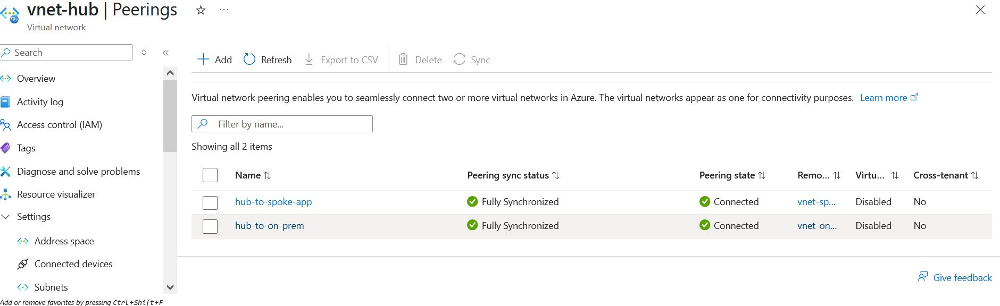
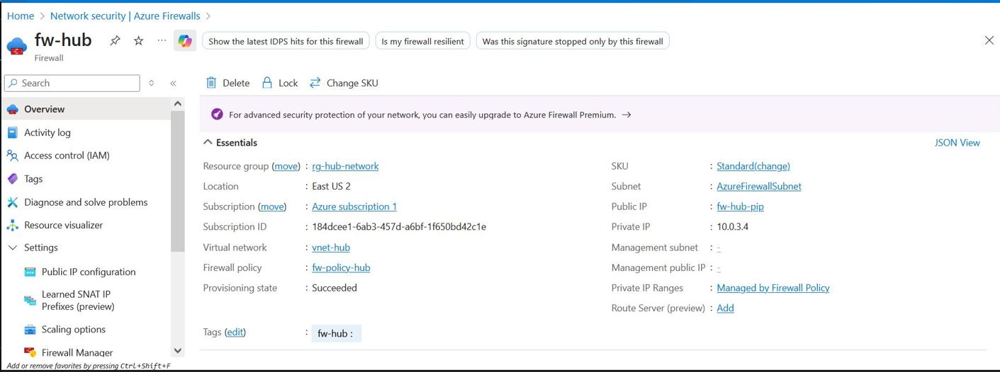
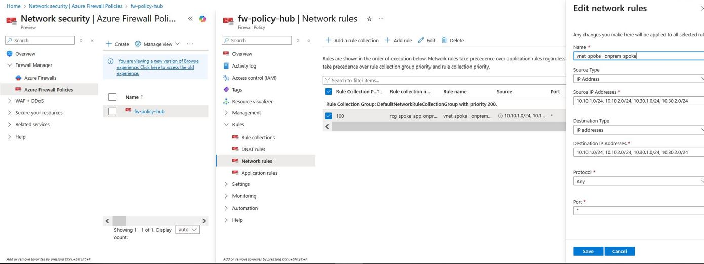

# Azure Hub-Spoke Architecture with Azure Firewall

A hands-on lab guide for implementing hub-spoke network topology with centralized Azure Firewall for spoke-to-spoke traffic routing.

## Table of Contents

- [Overview](#overview)
- [Architecture](#architecture)
- [Prerequisites](#prerequisites)
- [Lab Environment](#lab-environment)
- [Implementation Steps](#implementation-steps)
  - [Step 1: Create Virtual Networks](#step-1-create-virtual-networks)
  - [Step 2: Configure VNet Peering](#step-2-configure-vnet-peering)
  - [Step 3: Deploy Azure Firewall](#step-3-deploy-azure-firewall)
  - [Step 4: Configure Route Tables](#step-4-configure-route-tables)
  - [Step 5: Configure Firewall Rules](#step-5-configure-firewall-rules)
  - [Step 6: Deploy Test VMs](#step-6-deploy-test-vms)
- [Validation](#validation)
- [Cost Management](#cost-management)
- [Troubleshooting](#troubleshooting)
- [Clean Up](#clean-up)

---

## Overview

This lab demonstrates how to implement a hub-spoke network topology in Azure where all spoke-to-spoke traffic is routed through a centralized Azure Firewall in the hub VNet. This is a common enterprise architecture pattern that provides:

- ✅ Centralized network security and traffic inspection
- ✅ Simplified network management
- ✅ Cost optimization by sharing resources in the hub
- ✅ Network isolation between spokes

## Architecture


## Architecture

```text
                           +----------------------------------------+
                           |        vnet-spoke-app (10.10.0.0/16)   |
                           |----------------------------------------|
                           |  +----------------------------------+  |
                           |  | snet-app-web (10.10.1.0/24)      |  |
                           |  +----------------------------------+  |
                           |                                      |
                           |  +----------------------------------+  |
                           |  | snet-app-backend (10.10.2.0/24)  |  |
                           |  +----------------------------------+  |
                           +------------------------▲---------------+
                                                    ||
                                                    || vNet Peering
                                                    ||
+----------------------------------------+          ||        +----------------------------------------+
|        vnet-onprem (10.30.0.0/16)      |          ||        |        vnet-hub (10.0.0.0/16)          |
|----------------------------------------|          ||        |----------------------------------------|
|  +----------------------------------+  |==========||========|  +----------------------------------+  |
|  | snet-onprem-lan (10.30.1.0/24)  |  |  vNet Peering       |  | snet-hub-shared (10.0.1.0/24)   |  |
|  +----------------------------------+  |                   |  +----------------------------------+  |
|                                        |                   |                                        |
|  +----------------------------------+  |                   |  +----------------------------------+  |
|  | snet-onprem-lan2 (10.40.1.0/24) |  |                   |  | AzureFirewallSubnet (10.0.3.0/26)|  |
|  +----------------------------------+  |                   |  |        [ Azure Firewall ]        |  |
+----------------------------------------+                   |  +----------------------------------+  |
                                                            +----------------------------------------+

```

### Traffic Flow

When `vm-app` (10.10.2.4) pings `vm-onprem` (10.30.1.4):

```
vm-app → Route Table → Azure Firewall (10.0.3.4) → Route Table → vm-onprem
   │                         │                           │
   └─ Source: 10.10.2.4      └─ Inspects & forwards      └─ Destination: 10.30.1.4
```

---

## Prerequisites

- Azure subscription with Contributor access
- Azure CLI installed or access to Azure Cloud Shell
- Basic understanding of:
  - Virtual Networks and subnets
  - Network Security Groups
  - Azure Firewall concepts

---

## Lab Environment

### Resource Groups

| Resource Group | Purpose |
|----------------|---------|
| `rg-hub-network` | Hub VNet, Firewall, Route Tables |
| `rg-spoke-app` | Application spoke VNet and VMs |
| `rg-onprem-sim` | Simulated on-premises VNet and VMs |

### Network Address Spaces

| VNet | Address Space | Subnets |
|------|---------------|---------|
| vnet-hub | 10.0.0.0/16 | snet-hub-shared (10.0.1.0/24), AzureFirewallSubnet (10.0.3.0/26) |
| vnet-spoke-app | 10.10.0.0/16 | snet-app-web (10.10.1.0/24), snet-app-backend (10.10.2.0/24) |
| vnet-onprem | 10.30.0.0/16 | snet-onprem-lan (10.30.1.0/24), snet-onprem-lan2 (10.40.1.0/24) |

---

## Implementation Steps

### Step 1: Create Virtual Networks

#### 1.1 Create Resource Groups

```bash
az group create --name rg-hub-network --location eastus2
az group create --name rg-spoke-app --location eastus2
az group create --name rg-onprem-sim --location eastus2
```

#### 1.2 Create Hub VNet

```bash
az network vnet create \
  --resource-group rg-hub-network \
  --name vnet-hub \
  --address-prefix 10.0.0.0/16 \
  --subnet-name snet-hub-shared \
  --subnet-prefix 10.0.1.0/24
```

#### 1.3 Create Azure Firewall Subnet

> ⚠️ **Important**: The subnet name must be exactly `AzureFirewallSubnet` and minimum size /26

```bash
az network vnet subnet create \
  --resource-group rg-hub-network \
  --vnet-name vnet-hub \
  --name AzureFirewallSubnet \
  --address-prefix 10.0.3.0/26
```

#### 1.4 Create Spoke VNets

```bash
# Spoke App VNet
az network vnet create \
  --resource-group rg-spoke-app \
  --name vnet-spoke-app \
  --address-prefix 10.10.0.0/16 \
  --subnet-name snet-app-web \
  --subnet-prefix 10.10.1.0/24

az network vnet subnet create \
  --resource-group rg-spoke-app \
  --vnet-name vnet-spoke-app \
  --name snet-app-backend \
  --address-prefix 10.10.2.0/24

# OnPrem Simulation VNet
az network vnet create \
  --resource-group rg-onprem-sim \
  --name vnet-onprem \
  --address-prefix 10.30.0.0/16 \
  --subnet-name snet-onprem-lan \
  --subnet-prefix 10.30.1.0/24
```


---

### Step 2: Configure VNet Peering

#### 2.1 Create Peering: Hub ↔ Spoke-App


```bash
# Hub to Spoke-App
az network vnet peering create \
  --resource-group rg-hub-network \
  --name hub-to-spoke-app \
  --vnet-name vnet-hub \
  --remote-vnet /subscriptions/<subscription-id>/resourceGroups/rg-spoke-app/providers/Microsoft.Network/virtualNetworks/vnet-spoke-app \
  --allow-forwarded-traffic \
  --allow-vnet-access

# Spoke-App to Hub
az network vnet peering create \
  --resource-group rg-spoke-app \
  --name spoke-app-to-hub \
  --vnet-name vnet-spoke-app \
  --remote-vnet /subscriptions/<subscription-id>/resourceGroups/rg-hub-network/providers/Microsoft.Network/virtualNetworks/vnet-hub \
  --allow-forwarded-traffic \
  --allow-vnet-access
```

#### 2.2 Create Peering: Hub ↔ OnPrem

```bash
# Hub to OnPrem
az network vnet peering create \
  --resource-group rg-hub-network \
  --name hub-to-onprem \
  --vnet-name vnet-hub \
  --remote-vnet /subscriptions/<subscription-id>/resourceGroups/rg-onprem-sim/providers/Microsoft.Network/virtualNetworks/vnet-onprem \
  --allow-forwarded-traffic \
  --allow-vnet-access

# OnPrem to Hub
az network vnet peering create \
  --resource-group rg-onprem-sim \
  --name onprem-to-hub \
  --vnet-name vnet-onprem \
  --remote-vnet /subscriptions/<subscription-id>/resourceGroups/rg-hub-network/providers/Microsoft.Network/virtualNetworks/vnet-hub \
  --allow-forwarded-traffic \
  --allow-vnet-access
```

#### 2.3 Verify Peering Settings

## Peering Configuration Details




Ensure both peerings have these settings enabled:

| Setting | Value |
|---------|-------|
| Allow virtual network access | ✅ Enabled |
| Allow forwarded traffic | ✅ Enabled |
| Peering state | Connected |


> ⚠️ **Critical**: You must enable **"Allow forwarded traffic"** on both sides of each peering connection. Without this setting, traffic routed through the Azure Firewall will be dropped, and spoke-to-spoke communication will fail. This is the most common misconfiguration in hub-spoke architectures.


---

### Step 3: Deploy Azure Firewall





```bash
az network firewall policy create \
  --resource-group rg-hub-network \
  --name fw-policy-hub \
  --location eastus2
```


#### 3.2 Create Public IP for Firewall

```bash
az network public-ip create \
  --resource-group rg-hub-network \
  --name fw-hub-pip \
  --sku Standard \
  --allocation-method Static
```




#### 3.3 Deploy Azure Firewall

> ⚠️ **Cost Warning**: Azure Firewall Standard costs ~$1.25/hour (~$900/month). Use `az network firewall deallocate` when not in use.

```bash
az network firewall create \
  --resource-group rg-hub-network \
  --name fw-hub \
  --location eastus2 \
  --vnet-name vnet-hub \
  --firewall-policy fw-policy-hub \
  --public-ip fw-hub-pip \
  --sku AZFW_VNet \
  --tier Standard
```

#### 3.4 Get Firewall Private IP

```bash
az network firewall show \
  --resource-group rg-hub-network \
  --name fw-hub \
  --query "ipConfigurations[0].privateIPAddress" \
  --output tsv
```

> 📝 **Note**: Save this IP (e.g., `10.0.3.4`). You'll need it for route tables.


---

### Step 4: Configure Route Tables

#### 4.1 Create Route Table

```bash
az network route-table create \
  --resource-group rg-hub-network \
  --name rt-spoke-to-spoke \
  --location eastus2
```

#### 4.2 Add Routes

Route traffic from Spoke-App to OnPrem through Firewall:

```bash
az network route-table route create \
  --resource-group rg-hub-network \
  --route-table-name rt-spoke-to-spoke \
  --name to-onprem \
  --address-prefix 10.30.1.0/24 \
  --next-hop-type VirtualAppliance \
  --next-hop-ip-address 10.0.3.4
```

## Route Tables


Route traffic from OnPrem to Spoke-App through Firewall:

```bash
az network route-table route create \
  --resource-group rg-hub-network \
  --route-table-name rt-spoke-to-spoke \
  --name to-spoke-app-web \
  --address-prefix 10.10.1.0/24 \
  --next-hop-type VirtualAppliance \
  --next-hop-ip-address 10.0.3.4

az network route-table route create \
  --resource-group rg-hub-network \
  --route-table-name rt-spoke-to-spoke \
  --name to-spoke-app-backend \
  --address-prefix 10.10.2.0/24 \
  --next-hop-type VirtualAppliance \
  --next-hop-ip-address 10.0.3.4
```

#### 4.3 Associate Route Table to Subnets

```bash
# Associate to Spoke-App subnets
az network vnet subnet update \
  --resource-group rg-spoke-app \
  --vnet-name vnet-spoke-app \
  --name snet-app-web \
  --route-table /subscriptions/<subscription-id>/resourceGroups/rg-hub-network/providers/Microsoft.Network/routeTables/rt-spoke-to-spoke

az network vnet subnet update \
  --resource-group rg-spoke-app \
  --vnet-name vnet-spoke-app \
  --name snet-app-backend \
  --route-table /subscriptions/<subscription-id>/resourceGroups/rg-hub-network/providers/Microsoft.Network/routeTables/rt-spoke-to-spoke

# Associate to OnPrem subnet
az network vnet subnet update \
  --resource-group rg-onprem-sim \
  --vnet-name vnet-onprem \
  --name snet-onprem-lan \
  --route-table /subscriptions/<subscription-id>/resourceGroups/rg-hub-network/providers/Microsoft.Network/routeTables/rt-spoke-to-spoke
```


> ⚠️ **Critical**: Route tables must be **associated with the correct subnets** in each spoke VNet. Creating routes alone is not enough—you must go to the Route Table → Subnets → Associate and attach it to each subnet that needs to route traffic through the firewall. If the association is missing, traffic will use default Azure routing and bypass the firewall.


#### 4.4 Verify Route Configuration

| Route Name | Address Prefix | Next Hop Type | Next Hop IP |
|------------|----------------|---------------|-------------|
| to-onprem | 10.30.1.0/24 | VirtualAppliance | 10.0.3.4 |
| to-spoke-app-web | 10.10.1.0/24 | VirtualAppliance | 10.0.3.4 |
| to-spoke-app-backend | 10.10.2.0/24 | VirtualAppliance | 10.0.3.4 |


---

### Step 5: Configure Firewall Rules

#### 5.1 Create Rule Collection Group

**Portal Navigation**: Firewall Policy → Rule Collections → Add a rule collection

#### 5.2 Add Network Rule

| Setting | Value |
|---------|-------|
| Rule collection group | DefaultNetworkRuleCollectionGroup |
| Rule collection name | allow-spoke-traffic |
| Rule collection type | Network |
| Priority | 100 |
| Action | Allow |

| Rule | Source | Destination | Protocol | Port |
|------|--------|-------------|----------|------|
| allow-spoke-to-spoke | 10.10.1.0/24,10.10.2.0/24,10.30.1.0/24 | 10.10.1.0/24,10.10.2.0/24,10.30.1.0/24 | Any | * |


---

### Step 6: Deploy Test VMs

#### 6.1 Create VM in Spoke-App

```bash
az vm create \
  --resource-group rg-spoke-app \
  --name vm-app \
  --image Ubuntu2204 \
  --vnet-name vnet-spoke-app \
  --subnet snet-app-backend \
  --admin-username azureuser \
  --generate-ssh-keys \
  --size Standard_B1s
```

#### 6.2 Create VM in OnPrem

```bash
az vm create \
  --resource-group rg-onprem-sim \
  --name vm-onprem \
  --image Ubuntu2204 \
  --vnet-name vnet-onprem \
  --subnet snet-onprem-lan \
  --admin-username azureuser \
  --generate-ssh-keys \
  --size Standard_B1s
```

---

## Validation

### Test Connectivity

From `vm-app`, ping `vm-onprem`:

```bash
ping 10.30.1.4
```

From `vm-onprem`, ping `vm-app`:

```bash
ping 10.10.2.4
```

### Expected Result

```
PING 10.30.1.4 (10.30.1.4) 56(84) bytes of data.
64 bytes from 10.30.1.4: icmp_seq=1 ttl=63 time=2.64 ms
64 bytes from 10.30.1.4: icmp_seq=2 ttl=63 time=2.56 ms
64 bytes from 10.30.1.4: icmp_seq=3 ttl=63 time=3.05 ms
```

> 📝 **Note**: TTL=63 indicates traffic passed through the firewall (TTL decremented by 1)


### Verify Traffic Flow

```bash
az network watcher show-next-hop \
  --resource-group rg-spoke-app \
  --vm vm-app \
  --source-ip 10.10.2.4 \
  --dest-ip 10.30.1.4
```

Expected output:

```json
{
  "nextHopIpAddress": "10.0.3.4",
  "nextHopType": "VirtualAppliance",
  "routeTableId": "..."
}
```

---

## Cost Management

### Resource Costs (Approximate)

| Resource | Running | Deallocated |
|----------|---------|-------------|
| Azure Firewall Standard | ~$1.25/hour | $0 |
| VM (Standard_B1s) | ~$0.01/hour | $0 |
| Managed Disk | ~$1-5/month | ~$1-5/month |
| Public IP (Static) | ~$3-4/month | ~$3-4/month |
| VNet, Peering, Route Table | $0 | $0 |

### Deallocate Resources

```bash
# Deallocate Firewall
az network firewall deallocate \
  --resource-group rg-hub-network \
  --name fw-hub

# Deallocate VMs
az vm deallocate --resource-group rg-spoke-app --name vm-app --no-wait
az vm deallocate --resource-group rg-onprem-sim --name vm-onprem --no-wait
```

### Reallocate Firewall

```bash
az network firewall update \
  --resource-group rg-hub-network \
  --name fw-hub \
  --vnet-name vnet-hub \
  --public-ip fw-hub-pip
```

---

## Troubleshooting

### Problem: Ping fails between spokes

#### Check 1: Verify Peering Status

```bash
az network vnet peering list \
  --resource-group rg-hub-network \
  --vnet-name vnet-hub \
  --query "[].{name:name, state:peeringState, allowForwardedTraffic:allowForwardedTraffic}" \
  -o table
```

✅ **Expected**: State = Connected, allowForwardedTraffic = true

#### Check 2: Verify Route Table Association

```bash
az network vnet subnet show \
  --resource-group rg-spoke-app \
  --vnet-name vnet-spoke-app \
  --name snet-app-backend \
  --query "routeTable.id" \
  -o tsv
```

✅ **Expected**: Returns route table ID (not empty)

#### Check 3: Verify Next Hop

```bash
az network watcher show-next-hop \
  --resource-group rg-spoke-app \
  --vm vm-app \
  --source-ip 10.10.2.4 \
  --dest-ip 10.30.1.4
```

✅ **Expected**: nextHopType = VirtualAppliance, nextHopIpAddress = 10.0.3.4

❌ **If nextHopType = None**: Route table not associated or missing route

#### Check 4: Verify Firewall Status

```bash
az network firewall show \
  --resource-group rg-hub-network \
  --name fw-hub \
  --query "provisioningState" \
  -o tsv
```

✅ **Expected**: Succeeded

#### Check 5: Verify Firewall Rules

```bash
az network firewall policy rule-collection-group list \
  --policy-name fw-policy-hub \
  --resource-group rg-hub-network \
  -o json
```

✅ **Expected**: Network rule with source/destination matching spoke subnets, protocol = Any

### Problem: Route table won't save changes

**Cause**: Existing subnet uses an IP range outside the VNet address space

**Solution**:
1. Expand VNet address space to cover all subnets
2. Or remove conflicting subnets and recreate

### Problem: Cannot add address space to VNet

**Cause**: Active VNet peering may block changes (older behavior)

**Solution**:
1. Try adding address space and then sync peering
2. Or temporarily delete peering → add address space → recreate peering

### Problem: AzureFirewallSubnet creation fails

**Common Causes**:
- Subnet name must be exactly `AzureFirewallSubnet`
- Minimum size is /26
- Cannot overlap with existing subnets

### Problem: Traffic flows one direction only

**Cause**: Missing return route

**Solution**: Ensure both directions have routes:
- Spoke → OnPrem: Route in spoke subnet pointing to FW
- OnPrem → Spoke: Route in onprem subnet pointing to FW

---

## Clean Up

### Delete All Resources

```bash
az group delete --name rg-hub-network --yes --no-wait
az group delete --name rg-spoke-app --yes --no-wait
az group delete --name rg-onprem-sim --yes --no-wait
```

---


## References

- [Azure Hub-Spoke Architecture](https://docs.microsoft.com/azure/architecture/reference-architectures/hybrid-networking/hub-spoke)
- [Azure Firewall Documentation](https://docs.microsoft.com/azure/firewall/)
- [Virtual Network Peering](https://docs.microsoft.com/azure/virtual-network/virtual-network-peering-overview)
- [User-Defined Routes](https://docs.microsoft.com/azure/virtual-network/virtual-networks-udr-overview)

---

## License

This lab guide is provided for educational purposes.

